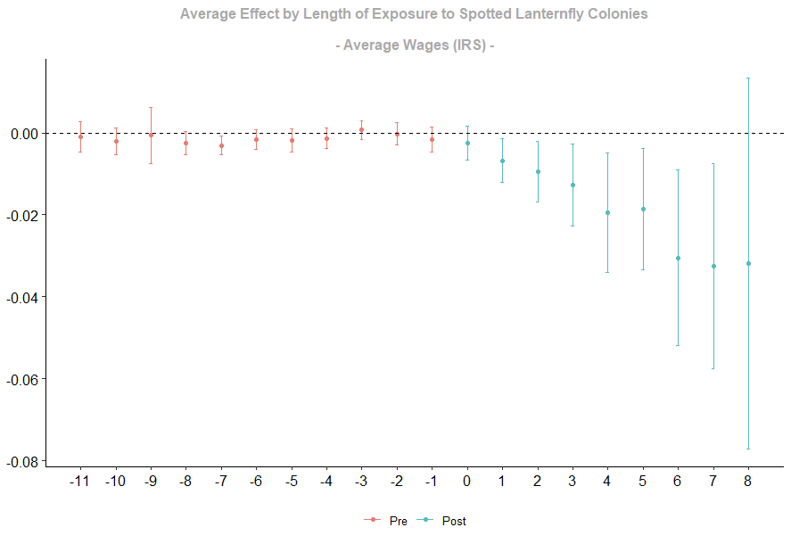
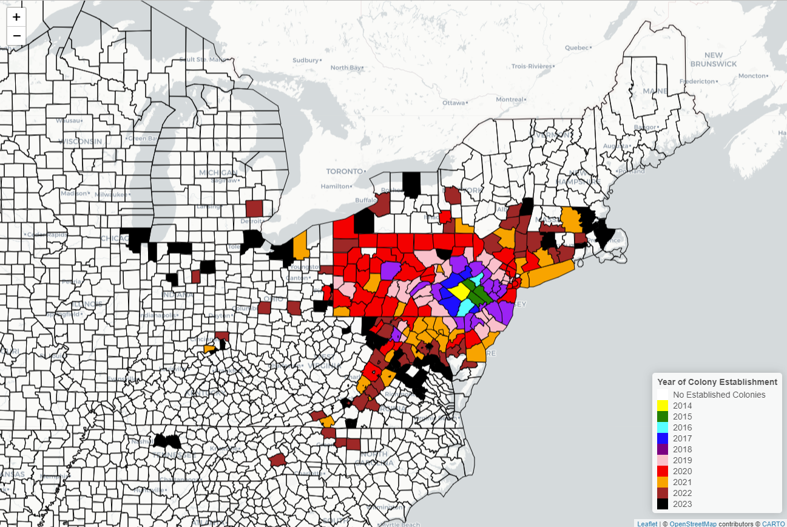

# SLF_local_labor_markets

This repository is for a paper that has been submitted to the *American Journal of Agricultural Economics* on the local labor market and land cover impacts of the spotted lanternfly (SLF). The code needed to replicate this is just a single file (slf_colonies.R). The data used for this paper is all freely available online and comes from the BEA, BLS, County Business Patterns, USDA ERS, IRS, National Land Cover Database, NOAA, and Zillow. Specific variables are thoroughly documented in the paper, but due to their collective size are not stored here.

Using a staggered difference-in-differences model, I find that average wages and the unemployment rate both decrease, while employment increases. The increase in employment is driven by the construction and urban amenities sectors. Motivating these results, I find that the SLF induces land use changes in the form of forested land being converted to developed land.

Evet study figure for the average wage effect using data from the IRS:

Location of established SLF colonies by the end of this study:

